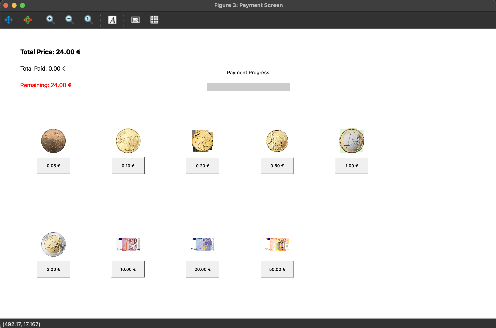

# 🥤 Vending Machine Simulation (Octave/MATLAB)

This project is a graphical vending machine simulation developed using GNU Octave / MATLAB.

It allows users to:
- Select products
- View prices
- Make payments
- Track remaining balance
- Receive change
- Complete purchases interactively

The project was developed as part of the **Introduction to Engineering** course.

---

## 🎯 Project Features

✅ Graphical User Interface (GUI)  
✅ Product selection system  
✅ Dynamic total price calculation  
✅ Payment system with coins and banknotes  
✅ Progress bar for payment  
✅ Change calculation  
✅ Error handling for missing images  

---

## 🛠 Technologies Used

- GNU Octave / MATLAB
- GUI (uicontrol, axes)
- Image Processing (imshow)
- Event-driven programming

---

## 📁 Project Structure

```

vending-machine-simulation/
│
├── src/
│   └── vending_machine_simulation.m
│
├── images/
│   └── (product and coin images)
│
└── README.md

````

---

## ▶️ How to Run

1. Install GNU Octave or MATLAB
2. Clone this repository:

```bash
git clone https://github.com/semihaseker/vending-machine-simulation.git
````

3. Open Octave / MATLAB
4. Navigate to the src folder
5. Run:

```matlab
vending_machine_simulation
```

---

## 📸 Screenshots

### 🏠 Welcome Screen


### 🛍️ Product Selection


### 💳 Payment Screen


### ✅ Payment Completed


These screenshots demonstrate the main workflow of the vending machine simulation,
from product selection to successful payment.

---

## 👩‍💻 Authors

* Semiha Şeker
* Yahya Tarık Tabağ

---

## 🚀 Future Improvements

* Online payment simulation
* Database integration
* More product categories
* Mobile-friendly interface

```

